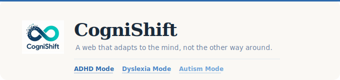
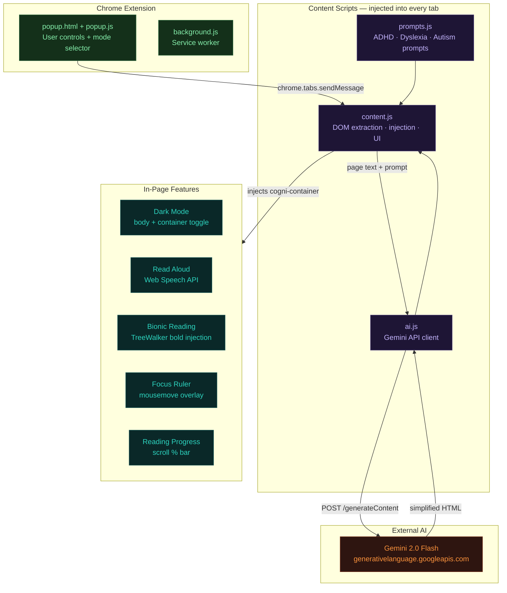

---

## Overview

CogniShift is an AI-powered Chrome extension that transforms any webpage into a neurodiverse-friendly reading experience. It uses Gemini 2.0 Flash to rewrite, simplify, and annotate web content in real time — tailored specifically for ADHD, Dyslexia, and Autism profiles.

The modern web is built for the neurotypical brain. CogniShift changes that.

---

## The Problem

| Challenge | Impact |
|-----------|--------|
| Sensory overload | Autoplay videos, flashing banners, and cluttered layouts cause rapid cognitive fatigue |
| Wall of text | Long unstructured articles feel insurmountable — students abandon research before starting |
| Implicit language | Idioms, sarcasm, and implied meaning are invisible barriers for many neurodiverse readers |
| No personalization | Browsers offer no built-in adaptation for different cognitive profiles |

---

## Architecture

---

## Features

### ADHD Focus Mode
- **AI Content Simplification** — Gemini rewrites complex text into short bullet points with a TL;DR summary at the top
- **Keyword Pastel Highlights** — core concepts highlighted in soft, non-stimulating colors
- **First Sentence Attention Cue** — first sentence of each paragraph subtly highlighted to anchor reading
- **Bionic Reading** — bolds the first half of every word, creating artificial fixation points for faster, more rhythmic reading
- **Focus Ruler** — a horizontal overlay that follows your cursor, creating a reading lane to prevent eye-wandering
- **Read Aloud** — Web Speech API TTS with Google voice preference, pause/resume support
- **Dark Mode** — full page dark theme toggle
- **Reading Progress Bar** — fixed progress indicator showing scroll percentage
- **Visual Reference Gallery** — extracts and displays relevant images from the page in a clean grid
- **Restore Original** — one click returns the page to its original state

### Dyslexia Mode
- Rewrites sentences into simple Subject-Verb-Object structure
- Short sentences (max 15 words), no passive voice, concrete vocabulary
- Coming soon in the UI

### Autism Mode
- Keeps original text unchanged
- Annotates idioms, sarcasm, and implied meaning inline
- Coming soon in the UI

---

## How It Works

| Step | Action |
|------|--------|
| 1 | User clicks "Run ADHD Focus Analysis" in the popup |
| 2 | `popup.js` sends `chrome.tabs.sendMessage` → `content.js` |
| 3 | `content.js` extracts page text + images via DOM |
| 4 | Text + mode-specific prompt passed to `ai.js` |
| 5 | `ai.js` POSTs to Gemini 2.0 Flash API |
| 6 | Response parsed + sanitized by `formatAIText()` |
| 7 | Reformatted HTML injected into page as `cogni-container` |
| 8 | In-page toggles (Dark, Speech, Bionic, Ruler) attached to DOM |

---

## File Structure
| File | Purpose |
|------|---------|
| `manifest.json` | Extension config — Manifest V3, permissions, content scripts |
| `popup.html` | Extension popup UI — tab switcher for 3 modes |
| `popup.js` | Tab switching logic, sends messages to content script |
| `content.js` | Core engine — DOM extraction, AI response injection, all feature toggles |
| `ai.js` | Gemini API client — reads key from `chrome.storage.local` |
| `prompts.js` | AI prompts — `ADHD_PROMPT`, `DYSLEXIA_PROMPT`, `AUTISM_PROMPT` |
| `background.js` | Service worker (Manifest V3 requirement) |
| `options.html` | Settings page — enter and save Gemini API key securely |
| `verification.html` | Local test page — verify UI without loading a real site |
| `banner.svg` | GitHub README banner |
| `logo.png` | Extension icon |

---

## Tech Stack

| Layer | Technology |
|-------|-----------|
| Extension platform | Chrome Extension — Manifest V3 |
| AI | Gemini 2.0 Flash (`generateContent` REST API) |
| Content processing | Vanilla JavaScript — TreeWalker, DOM injection, regex markdown parser |
| Text to speech | Web Speech API (`SpeechSynthesisUtterance`) |
| Styling | Injected CSS — dark mode variables, bionic bold, focus ruler overlay |
| Security | API key stored in `chrome.storage.local` via options page — never hardcoded |

---

## Installation

> Chrome Web Store listing coming soon. Install manually for now:

Clone or download this repo
Open Chrome → chrome://extensions
Enable "Developer mode" (top right toggle)
Click "Load unpacked"
Select the CogniShift folder
Right-click the extension icon → Options → paste your Gemini API key

### Getting a Gemini API Key

1. Go to [aistudio.google.com](https://aistudio.google.com)
2. Click "Get API Key" → Create API Key
3. Right-click the CogniShift icon in Chrome → Options
4. Paste your key and click Save

---

## Roadmap

| Feature | Status |
|---------|--------|
| ADHD Focus Mode | Done |
| API key via options page | Done |
| Dyslexia Mode UI | In Progress |
| Autism Mode UI | In Progress |
| On-device inference (no API key needed) | Planned |
| Firefox support | Planned |
| Productivity dashboard with Chart.js | Planned |
| User profiles — save preferences per site | Planned |

---

## Contributors

Built at Innovate 3.0 Hackathon, JIIT Noida

[@harsh-sagar03](https://github.com/harsh-sagar03) · [@AnuTyagi-1306](https://github.com/AnuTyagi-1306) · [@sharmaanwesha](https://github.com/sharmaanwesha) · [@SrizaGoel](https://github.com/SrizaGoel) · [@vishaljaiswal14](https://github.com/vishaljaiswal14)

---

Making the web readable for every mind

[github.com/AnuTyagi-1306](https://github.com/AnuTyagi-1306)

